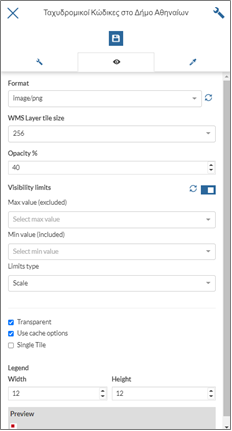
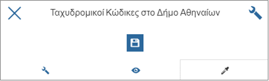
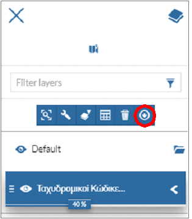

.. _layeradvancedfeatures:

================================================
Διαχείριση Επιπέδων – Εξειδικευμένες Λειτουργίες
================================================

Εκτός από τις βασικές λειτουργίες διαχείρισης επιπέδων, στην Γεωπύλη παρέχονται εξειδικευμένες λειτουργίες εμφάνισης και φιλτραρίσματος των δεδομένων.
Επιλέγοντας ένα επίπεδο από το παράθυρο διαχείρισης επιπέδων, εμφανίζονται αυτές οι επιπλέον λειτουργίες.

.. figure:: img/Image82.png
        :width: 50%

Ο χρήστης μπορεί να εστιάσει στο επιλεγμένο θεματικό επίπεδο (1), να ορίσει τις ρυθμίσεις του επιπέδου (2) να φιλτράρει το θεματικό επίπεδο βάσει περιγραφικών ή χωρικών ερωτημάτων (3), να εμφανίσει τον πίνακα ιδιοτήτων του επιπέδου (4), να διαγράψει το επίπεδο από το χάρτη (5) ή να κάνει εξαγωγή των δεδομένων του επιπέδου (6).

Α. Ρυθμίσεις Επιπέδου
======================
Ο χρήστης μπορεί να ορίσει βασικές ρυθμίσεις του επιπέδου. Στις γενικές ρυθμίσεις, εισάγονται τα περιγραφικά χαρακτηριστικά του επιπέδου.

.. figure:: img/Image83.png
        :width: 50%

Στη δεύτερη καρτέλα ορίζεται ο τρόπος εμφάνισης του επιπέδου

και στην τρίτη, το στυλ εμφάνισης.

.. figure:: img/Image85.png
        :width: 50%

Οι ρυθμίσεις αποθηκεύονται για την εμφάνιση του επιπέδου στη συγκεκριμένη καρτέλα του περιηγητή.

Β. Φιλτράρισμα Επιπέδου
========================
Υπάρχει δυνατότητα επιλογής των στοιχείων που θα απεικονιστούν, ορίζοντας το κατάλληλο φίλτρο (Επισκόπηση Χάρτη - :ref:`Φιλτράρισμα Επιπέδου`).

Γ. Εμφάνιση Πίνακα Ιδιοτήτων
=============================
Αφού γίνει η επιλογή του επιπέδου, μπορεί να εμφανιστεί ο πίνακας ιδιοτήτων του. Εκεί πραγματοποιείται φιλτράρισμα των δεδομένων, γίνεται λήψη των δεδομένων, διαχείριση των πεδίων του πίνακα και συγχρονισμός του χάρτη με το φίλτρο που έχει οριστεί (:ref:`Εμφάνιση Πίνακα Ιδιοτήτων`).

Δ. Εξαγωγή Δεδομένων Επιπέδου
=============================
Όταν γίνει επιλογή της εξαγωγής δεδομένων, εμφανίζεται το αντίστοιχο παράθυρο ορισμού των παραμέτρων, σύμφωνα με όσα περιγράφονται στην Επισκόπηση Χάρτη - :ref:`Ενότητα Β.3`.

