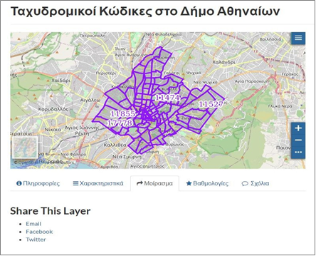
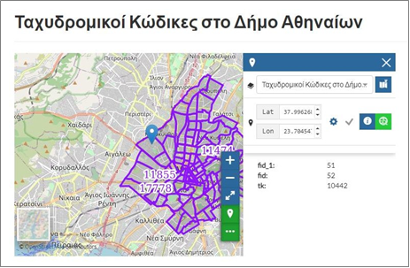
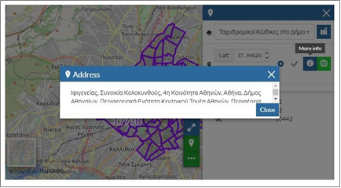
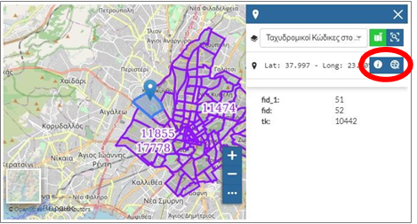
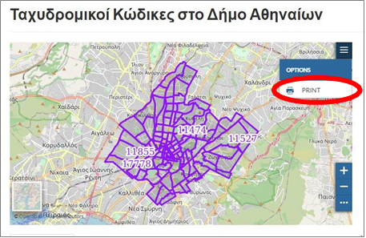
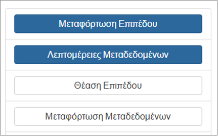

.. _layerbasicfeatures:

============================
Βασικές Λειτουργίες Επιπέδων
============================

Επιλέγοντας κάποιο στοιχείο από την ενότητα «Δεδομένα – Επίπεδα» εμφανίζεται το αντίστοιχο επίπεδο με τα γεωμετρικά και περιγραφικά του χαρακτηριστικά και τα εργαλεία επισκόπησής του και περιήγησης σε αυτό.
Τα διαθέσιμα εργαλεία της συγκεκριμένης ενότητας θα παρουσιαστούν για το επίπεδο `«Ταχυδρομικοί Κώδικες στο Δήμο Αθηναίων»`_.

.. _«Ταχυδρομικοί Κώδικες στο Δήμο Αθηναίων»: http://gis.cityofathens.gr/layers/athens_geonode_data:geonode:tk_da

.. figure:: img/Image66.png
        :width: 50%

Στην πρώτη σελίδα εμφανίζεται ο χάρτης με το επίπεδο και υπόβαθρο το `«Open Street Map»`_.
Ο χρήστης μπορεί να πληροφορηθεί σχετικά με το επίπεδο (καρτέλα «Πληροφορίες»), τα πεδία που περιλαμβάνει (καρτέλα «Χαρακτηριστικά»)

.. figure:: img/Image67.png
        :width: 50%

και να μοιραστεί το επίπεδο (καρτέλα «Μοίρασμα»).

.. _«Open Street Map»: https://www.openstreetmap.org/copyright

Στην περιοχή του χάρτη πραγματοποιείται πλοήγηση, μεγέθυνση και σμίκρυνση, εμφάνιση πληροφοριών του επιπέδου στο σημείο ενδιαφέροντος

Ακόμα, μπορούν να εμφανιστούν περισσότερες πληροφορίες για το συγκεκριμένο σημείο.

Υπάρχει δυνατότητα επισήμανσης του επιλεγμένου στοιχείου και εστίασης σε αυτό.

Ο χάρτης εκπυπώνεται επιλέγοντας το :guilabel:`PRINT`.

Ακόμα, υπάρχει η δυνατότητα μεταφόρτωσης του επιπέδου, επισκόπησης των μεταδεδομένων, θέασης του επιπέδου σε πλήρη οθόνη και μεταφόρτωσης των μεταδεδομένων.

.. toctree::
   :maxdepth: 2

   layerdownload
   metadata
   users\data_layers\viewlayer\index
   metadatadownload