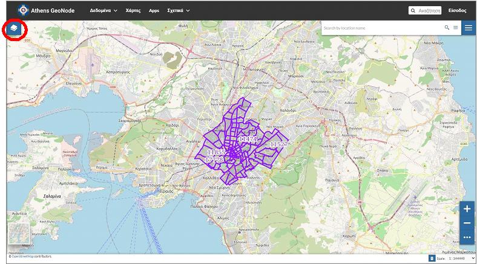
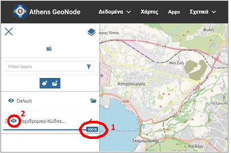
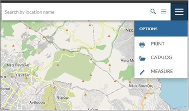

.. _layerviewbasicfeatures:

===========================================
Διαχείριση Επιπέδων – Βασικές Λειτουργίες
===========================================

Ανοίγοντας την καρτέλα «Επίπεδα»,

ορίζεται η διαφάνεια του επιπέδου (1) και μπορεί να γίνει απόκρυψη και επανεμφάνισή του (2).

Υπάρχει δυνατότητα εκτύπωσης, φόρτωσης επιπλέον επιπέδων από τον κατάλογο και μέτρησης, όπως έχουν περιγραφεί στην Ενότητα :ref:`printmeasetc`.

