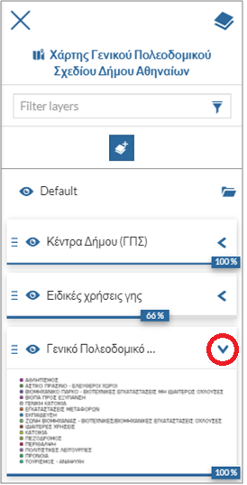
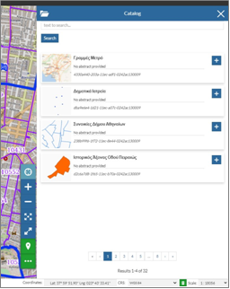

.. _layersettings:

=================================================
Διαχείριση Επιπέδων Χάρτη – Βασικές Λειτουργίες
=================================================

Η διαχείριση των επιπέδων πραγματοποιείται από την καρτέλα «Επίπεδα».

Ρυθμίσεις Διαφάνειας Επιπέδου
=============================

Εκεί ορίζεται η διαφάνεια του κάθε επιπέδου (1) και μπορεί να γίνει απόκρυψη και επανεμφάνισή του (2).

.. figure:: img/Image27.png
        :width: 75%

Συμβολισμός Επιπέδου
=====================

Ο χρήστης μπορεί να πληροφορηθεί σχετικά με το συμβολισμό των επιπέδων,
όπως φαίνεται παρακάτω για το `«Χάρτη Γενικού Πολεοδομικού Σχεδίου Δήμου Αθηναίων»`_.

.. _«Χάρτη Γενικού Πολεοδομικού Σχεδίου Δήμου Αθηναίων»: http://gis.cityofathens.gr/maps/125/view#/

.. _Εισαγωγή Επιπέδου:

Εισαγωγή Επιπέδου
==================

Στο δυναμικό χάρτη μπορούν να εισαχθούν επιπλέον επίπεδα (3), επιλέγοντας το επιθυμητό μετά από αναζήτηση.

