.. _layersettingsadv:

======================================================
Διαχείριση Επιπέδων Χάρτη – Εξειδικευμένες Λειτουργίες
======================================================

Εκτός από τις βασικές λειτουργίες διαχείρισης επιπέδων του χάρτη, στην Γεωπύλη παρέχονται εξειδικευμένες λειτουργίες εμφάνισης και φιλτραρίσματος των δεδομένων.
Επιλέγοντας ένα επίπεδο από το παράθυρο διαχείρισης επιπέδων, εμφανίζονται αυτές οι επιπλέον λειτουργίες.

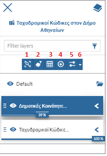

Ο χρήστης μπορεί να εστιάσει στο επιλεγμένο θεματικό επίπεδο (1), να φιλτράρει το θεματικό επίπεδο βάσει περιγραφικών ή χωρικών ερωτημάτων (2),
να εμφανίσει τον πίνακα ιδιοτήτων του επιπέδου (3), να κάνει εξαγωγή των δεδομένων του επιπέδου (4), να συγκρίνει το επίπεδο με τα άλλα επίπεδα του χάρτη (5).

.. _Φιλτράρισμα Επιπέδου:

Α. Φιλτράρισμα Επιπέδου
========================
Ανάλογα με το επίπεδο που θα επιλεγεί, εμφανίζονται οι επιλογές φιλτραρίσματος,
ορίζοντας τα περιγραφικά χαρακτηριστικά, την περιοχή ενδιαφέροντος ή/και τη χωρική σχέση των αντικειμένων του σε σχέση με άλλα επίπεδα.

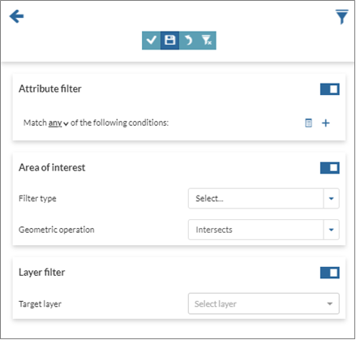

.. _Ενότητα A.1:

Α.1 Φιλτράρισμα βάσει Περιγραφικών Χαρακτηριστικών
---------------------------------------------------

Για να επιλεγούν τα στοιχεία του επιπέδου βάσει περιγραφικών χαρακτηριστικών, γίνεται προσθήκη νέας συνθήκης (2)
και οι ορίζονται οι παράμετροί της. Επιλέγονται το πεδίο του επιπέδου (οι τιμές του θα καθορίσουν τη συνθήκη),
ο τελεστής και η τιμή για το φιλτράρισμα (3, 4 και 5).

Οποιαδήποτε συνθήκη μπορεί να διαγραφεί (6).

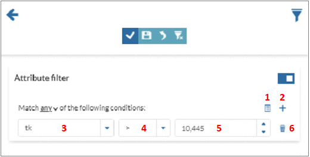

Ακόμα, είναι δυνατή η δημιουργία ομάδων συνθηκών (1), ορίζοντας τους λογικούς τελεστές για τη μεταξύ τους σχέση.

.. figure:: img/Image33.png
        :width: 75%

Μπορούν να προστεθούν επιπλέον συνθήκες, ορίζοντας τους κατάλληλους λογικούς τελεστές.

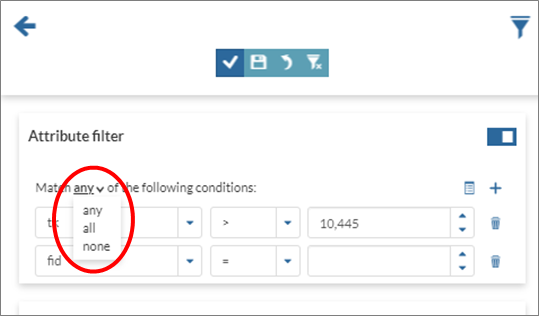

Α.2 Φιλτράρισμα βάσει Περιοχής Ενδιαφέροντος
---------------------------------------------
Ο χρήστης μπορεί να ορίσει το σχήμα της περιοχής ενδιαφέροντος.

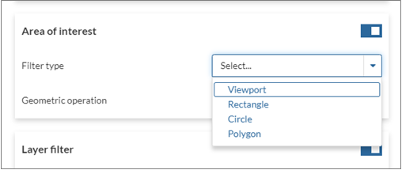

Σε συνδυασμό με το χωρικό τελεστή θα καθορίσει την επιλογή των αντικειμένων.

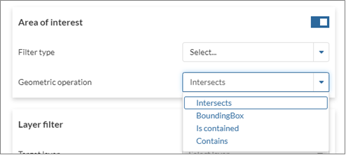

Αφού σχεδιαστεί το σχήμα της περιοχής, μπορούν να τροποποιηθούν τα γεωμετρικά χαρακτηριστικά του, ανάλογα με το είδος του σχήματος που έχει οριστεί.

.. figure:: img/Image36.png
        :width: 75%

Α.3 Φιλτράρισμα βάσει Χωρικής Σχέσης
--------------------------------------
Επιλέγοντας ένα επίπεδο από εκείνα του χάρτη (1) και ορίζοντας τη χωρική του σχέση με το αρχικό (2), φιλτράρονται τα στοιχεία του επιπέδου ανάλογα.
Προαιρετικά, επιλέγονται τα περιγραφικά χαρακτηριστικά των αντικειμένων του (3), φιλτράροντάς το πριν την εφαρμογή της χωρικής σχέσης.
Στην τελευταία περίπτωση ισχύουν όσα έχουν αναφερθεί στην `Ενότητα A.1`_.

.. figure:: img/Image37.png
        :width: 75%

Α.4 Συνδυασμός Φίλτρων
-----------------------
Τα παραπάνω φίλτρα μπορούν να συνδυαστούν μεταξύ τους, ορίζοντας τον επιθυμητό λογικό τελεστή (1).
Ακόμα, ενεργοποιούνται και απενεργοποιούνται (2), ώστε να λάβουν μέρος ή όχι στην τελική επιλογή.

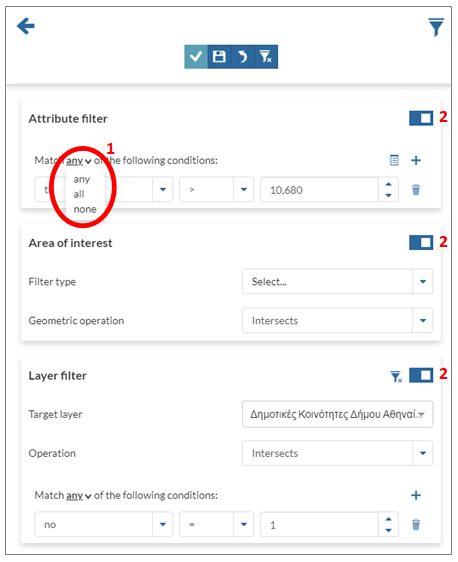

Α.5 Εφαρμογή Φίλτρου
----------------------
Αφού οριστούν οι παράμετροι των φίλτρων και εφαρμόζοντάς τα, απεικονίζεται το αποτέλεσμα στο χάρτη.

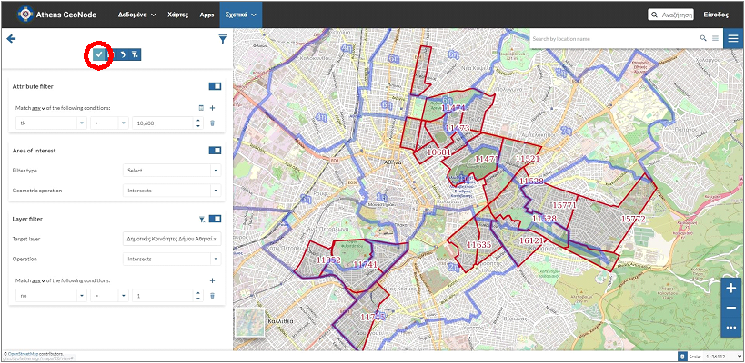

Α.6 Αποθήκευση – Αναίρεση - Καθαρισμός Φίλτρου
-----------------------------------------------
Αφού γίνει η εφαρμογή του φίλτρου, ο χρήστης μπορεί να το αποθηκεύσει (1),
να αναιρέσει τις τελευταίες αλλαγές (2) ή να καθαρίσει όλα τα φίλτρα (3).

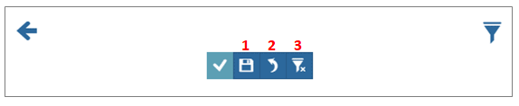

.. _Εμφάνιση Πίνακα Ιδιοτήτων:

Β. Εμφάνιση Πίνακα Ιδιοτήτων
=============================
Αφού γίνει η επιλογή του επιπέδου, μπορεί να εμφανιστεί ο πίνακας ιδιοτήτων του.

#.

  .. figure:: img/Image41.png
        :width: 50%

#.

  .. figure:: img/Image42.png
        :width: 100%

Μπορεί να πραγματοποιηθεί φιλτράρισμα των δεδομένων επιλέγοντας στοιχεία από το χάρτη (1) ή ορίζοντας βασικές παραμέτρους στα αντίστοιχα πεδία (2),
να εμφανιστούν οι εξειδικευμένες λειτουργίες φιλτραρίσματος που παρουσιάστηκαν στην `Ενότητα A`_ (3), να γίνει λήψη των δεδομένων (4),
διαχείριση των πεδίων του πίνακα (5) και να συγχρονιστεί ο χάρτης με το φίλτρο που έχει οριστεί (6).
Στο κάτω μέρος του πίνακα εμφανίζονται οι συνολικές εγγραφές (αν δεν έχει οριστεί φίλτρο), οι επιλεγμένες ή εκείνες που έχουν φιλτραριστεί (7).

.. figure:: img/Image43.png
        :width: 50%

Β.1 Φιλτράρισμα με Επιλογή στο Χάρτη
-------------------------------------
Πατώντας το αντίστοιχο κουμπί (1), ο χρήστης μπορεί να επιλέξει αντικείμενα του συγκεκριμένου επιπέδου στο χάρτη,
τα οποία θα εμφανιστούν στον πίνακα ιδιοτήτων. Με απλό κλικ επιλέγεται ένα αντικείμενο, οι ιδιότητες του οποίου εμφανίζονται στον πίνακα.
Υπάρχει δυνατότητα διαγραφής της επιλογής.

.. figure:: img/Image44.png
        :width: 75%

|
#. Πατώντας :guilabel:`Alt` ορίζεται το πλαίσιο.

   .. figure:: img/Image45.png
        :width: 75%

#. Επιλέγονται τα στοιχεία εντός του πλαισίου. Στον πίνακα εμφανίζονται οι αντίστοιχες εγγραφές.

   .. figure:: img/Image46.png
        :width: 75%

Ακόμα, μπορούν να επιλεγούν πολλαπλά αντικείμενα, έχοντας πατημένο το :guilabel:`Ctrl` και κάνοντας κλικ σε κάθε αντικείμενο του χάρτη.
Στον πίνακα εμφανίζονται οι αντίστοιχες εγγραφές.

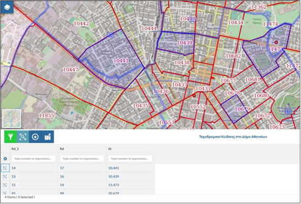

Αφού γίνει η επιλογή, είναι δυνατή η εστίαση σε κάθε εγγραφή του πίνακα.

.. figure:: img/Image48.png
        :width: 75%

Β.2 Φιλτράρισμα με Ορισμό Τιμών Πεδίων
--------------------------------------
Τα αντικείμενα του επιπέδου μπορούν να φιλτραριστούν ορίζοντας απλές συνθήκες στα αντίστοιχα πεδία.
Στο κάτω μέρος του πίνακα εμφανίζεται το πλήθος των επιλεγμένων στοιχείων.

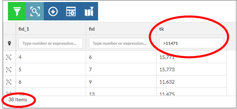

.. _Ενότητα Β.3:

Β.3 Λήψη Δεδομένων
------------------
Για τη λήψη των δεδομένων ορίζονται οι ιδιότητες του αρχείου και το σύστημα αναφοράς (1 και 2).
Προαιρετικά γίνεται εξαγωγή των αντικειμένων που εμφανίζονται στο χάρτη (3) ή εκείνων που έχουν επιλεγεί από το φίλτρο (4).
Στη συνέχεα επιλέγεται η εξαγωγή τους (5).

.. figure:: img/Image50.png
        :width: 75%

Με εμφάνιση των αποτελεσμάτων εξαγωγής

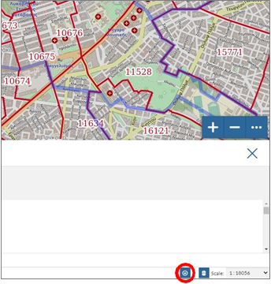

μπορεί να γίνει αποθήκευση ή διαγραφή τους (1, 2).

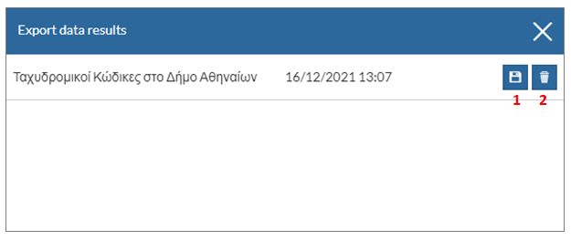

Β.4 Διαχείριση Πεδίων
----------------------
Ο χρήστης μπορεί να επιλέξει τα πεδία που θα εμφανίζονται στον πίνακα ιδιοτήτων.

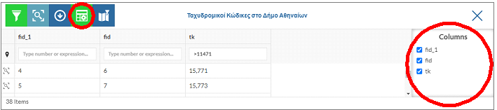

Β.5 Συγχρονισμός Χάρτη
----------------------
Τα δεδομένα που επιλέγονται στον πίνακα ιδιοτήτων μπορούν να εμφανίζονται ταυτόχρονα και στο χάρτη.

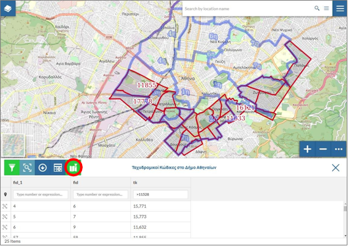

Γ. Εξαγωγή Δεδομένων Επιπέδου
==============================
Όταν γίνει επιλογή της εξαγωγής δεδομένων, εμφανίζεται το αντίστοιχο παράθυρο ορισμού των παραμέτρων, σύμφωνα με την `Ενότητα Β.3`_

.. figure:: img/Image55.png
        :width: 40%

Δ. Σύγκριση Επιπέδων
=====================
Ο χρήστης μπορεί να συγκρίνει το επιλεγμένο επίπεδο με τα υπόλοιπα επίπεδα του χάρτη.
Επιλέγοντας τη συγκεκριμένη λειτουργία, εμφανίζεται μία κάθετη γραμμή που διαιρεί το χάρτη με τέτοιο τρόπο, ώστε στη δεξιά πλευρά εμφανίζονται όλα τα θεματικά επίπεδα και στην αριστερή γίνεται απόκρυψη του επιπέδου που έχει επιλεγεί.
Με κύλιση αυτής της γραμμής εμφανίζονται και αποκρύπτονται τα αντίστοιχα στοιχεία του χάρτη.

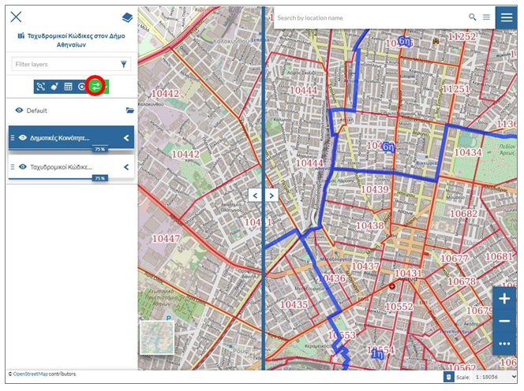

Η διεύθυνση της γραμμής διαίρεσης του χάρτη μπορεί να οριστεί οριζόντια.

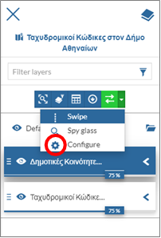
.. figure:: img/Image58.png
        :width: 50%

Η σύγκριση επιπέδων μπορεί να γίνει εντός κυκλικής περιοχής.

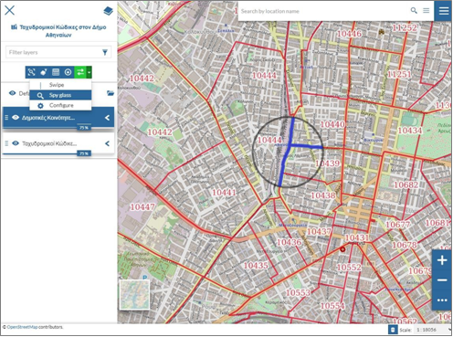

Η ακτίνα της ορίζεται από τον χρήστη.

.. figure:: img/Image60.png
        :width: 40%
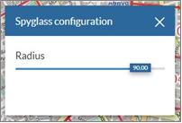