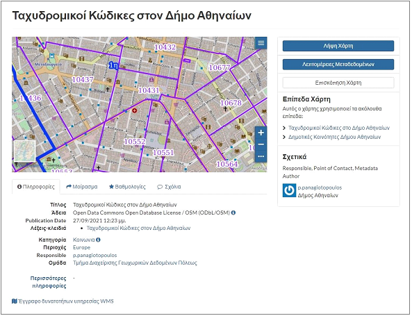
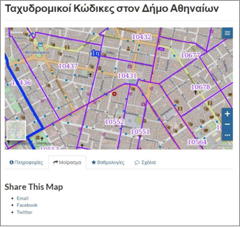
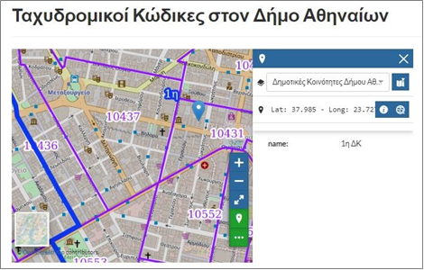
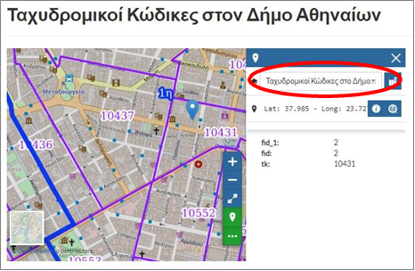
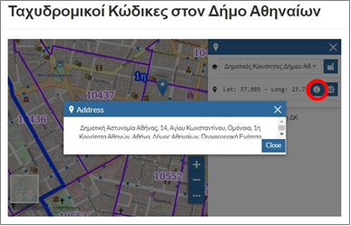
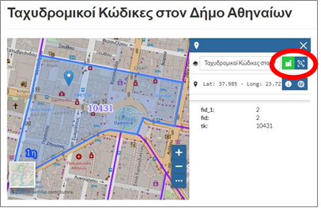
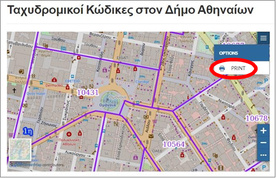
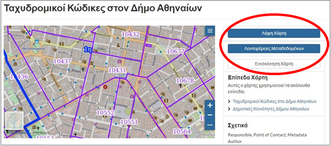

.. _mapbasicfeatures:

==============================
Βασικές Λειτουργίες Χαρτών
==============================

Επιλέγοντας κάποιο στοιχείο από την ενότητα «Χάρτες» εμφανίζεται ο δυναμικός χάρτης με τα αντίστοιχα επίπεδα, τις σχετικές πληροφορίες και τα εργαλεία επισκόπησής του και περιήγησης σε αυτόν. Τα διαθέσιμα εργαλεία της συγκεκριμένης ενότητας θα παρουσιαστούν
για το χάρτη `«Ταχυδρομικοί Κώδικες στον Δήμο Αθηναίων»`_.

.. _«Ταχυδρομικοί Κώδικες στον Δήμο Αθηναίων»: http://gis.cityofathens.gr/maps/26

Στην πρώτη σελίδα εμφανίζεται ο χάρτης με τα επίπεδα που τον αποτελούν και υπόβαθρο του
`«Open Street Map»`_.

.. _«Open Street Map»: https://www.openstreetmap.org/copyright

Ο χρήστης μπορεί να πληροφορηθεί σχετικά με το χάρτη (καρτέλα «Πληροφορίες») και τα επίπεδα που χρησιμοποιούνται («Επίπεδα Χάρτη»).

Ο διαμοιρασμός του επιπέδου πραγματοποιαίται από την καρτέλα «Μοίρασμα».

Στην περιοχή του χάρτη πραγματοποιείται πλοήγηση, μεγέθυνση
και σμίκρυνση, εμφάνιση των περιγραφικών χαρακτηριστικών των επιπέδων στο σημείο ενδιαφέροντος.

Υπάρχει δυνατότητα εναλλαγής των επιπέδων για τα οποία εμφανίζονται τα περιγραφικά χαρακτηριστικά.

Ακόμα, μπορούν να εμφανιστούν περισσότερες πληροφορίες για το συγκεκριμένο σημείο.

Το επιλεγμένο στοιχείο επισημαίνεται και γίνεται εστίαση σε αυτό.

Η εκτύπωση του χάρτη πραγματοποιείται από τις επιλογές επάνω δεξιά.

Ο χρήστης μπορεί να κάνει λήψη του χάρτη, να πληροφορηθεί για τα μεταδεδομένα και να κάνει επισκόπηση του χάρτη.

.. toctree::
   :maxdepth: 2

   downloadmap
   metadata
   viewmap