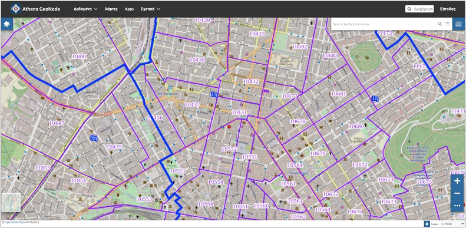
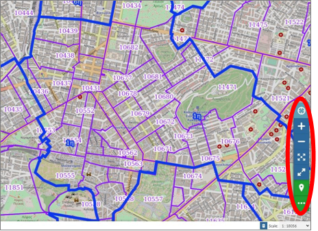
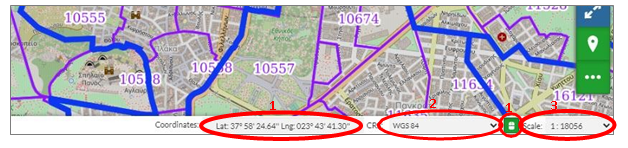

.. _viewmap:

================
Επισκόπηση Χάρτη
================

Επιλέγοντας την «Επισκόπηση Χάρτη» εμφανίζεται στο παράθυρο μόνο ο χάρτης με το υπόβαθρο,
όπου υπάρχουν οι δυνατότητες αναζήτησης πληροφοριών που παρουσιάστηκαν στο :ref:`mapbasicfeatures`, καθώς και επιπλέον λειτουργίες.

Ο χρήστης έχει τη δυνατότητα να πλοηγηθεί στο επίπεδο να κάνει μεγέθυνση και σμίκρυνση ή να ανοίξει το επίπεδο σε πλήρη οθόνη.

Ακόμα, μπορεί να εμφανίσει τις συντεταγμένες του κέρσορα, καθώς κινείται στο υπόβαθρο (1), να επιλέξει το σύστημα αναφοράς (2) και να ορίσει την κλίμακα (3).

Στην Επισκόπηση Χάρτη υπάρχουν οι παρακάτω λειτουργίες:

.. toctree::
    :hidden:
    :maxdepth: 5

    users/maps/viewmap/poisearch
    users/maps/viewmap/layersettings
    users/maps/viewmap/layersettingsadv
    users/maps/viewmap/printmeasetc