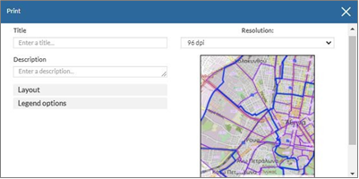
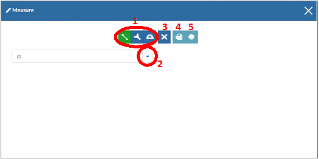

.. _printmeasetc:

======================================================
Εκτύπωση – Εισαγωγή Επιπέδου – Μέτρηση - Διαμοιρασμός
======================================================

Υπάρχει δυνατότητα εκτύπωσης, εισαγωγής επιπλέον επιπέδων από τον κατάλογο, μέτρησης και διαμοιρασμού.

Α. Εκτύπωση Χάρτη
==================

Επιλέγοντας την «Εκτύπωση Χάρτη» εμφανίζεται το παράθυρο εισαγωγής των παραμέτρων εκτύπωσης. Εκεί μπορούν να εισαχθούν ο τίτλος και η περιγραφή του χάρτη, η ανάλυση εκτύπωσης, το μέγεθος της σελίδας, τα χαρακτηριστικά του υπομνήματος κ.ά.

Β. Εισαγωγή Επιπέδου
======================

Στο δυναμικό χάρτη μπορούν να εισαχθούν επιπλέον επίπεδα, επιλέγοντας το επιθυμητό μετά από αναζήτηση.

.. figure:: img/Image28.png
        :width: 50%

Γ. Μέτρηση
===========
Για την πραγματοποίηση μετρήσεων, εμφανίζεται το παράθυρο, όπου αρχικά επιλέγονται το μέγεθος προς μέτρηση: μήκος, επιφάνεια, γωνία διεύθυνσης (1)
και η αντίστοιχη μονάδα μέτρησης (2).
Αφού ολοκληρωθεί η μέτρηση, υπάρχει δυνατότητα διαγραφής της (3), εξαγωγής της σε μορφή GeoJSON (4) και εισαγωγής της στο χάρτη ως θεματικό επίπεδο (5).

Δ. Διαμοιρασμός
================
Ο διαμοιρασμός μπορεί να γίνει μέσω συνδέσμου ή μέσω ενσωματωμένου κώδικα.

.. figure:: img/Image65.png
        :width: 50%