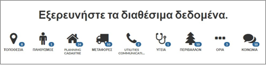

.. _categorysearch:

===============================
Αναζήτηση με βάση την Κατηγορία
===============================

Αν ο χρήστης επιθυμεί να εξερευνήσει τα διαθέσιμα δεδομένα βάσει των κατηγοριών: Τοποθεσία, Πληθυσμός, Planning Cadastre, Μεταφορές, Utilities Communication, Υγεία, Περιβάλλον, Όρια ή Κοινωνία, μπορεί να επιλέξει την επιθυμητή κατηγορία και να εμφανιστούν όλα τα διαθέσιμα στοιχεία.

Στη συνέχεια, μπορεί να γίνει επιπλέον φιλτράρισμα των δεδομένων.

.. figure:: img/Image9a.png
        :width: 50%