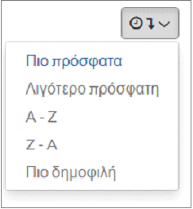

.. _exploreall:

===============================
Εξερεύνηση όλων των Πόρων
===============================

Ο χρήστης μπορεί να εξερευνήσει όλα τα Δεδομένα (Επίπεδα, Έγγραφα, Ηλεκτρονικές Υπηρεσίες)
και τους Χάρτες επιλέγοντας την επιθυμητή κατηγορία από το κεντρικό μενού, που βρίσκεται πάνω αριστερά.

Στη σελίδα που εμφανίζεται στη συνέχεια, απεικονίζονται όλα τα στοιχεία της συγκεκριμένης κατηγορίας. Υπάρχουν οι κάτωθι δυνατότητες αναζήτησης του επιθυμητού επιπέδου:

-	εξερευνώντας τα ένα προς ένα

-	ταξινομώντας τα βάσει ημερομηνίας ανάρτησης, αλφαβητικά ή βάσει δημοτικότητάς τους

-	περιορίζοντας τα στοιχεία που εμφανίζονται ορίζοντας το αντίστοιχο φίλτρο

.. figure:: img/Image12.png
        :width: 35%