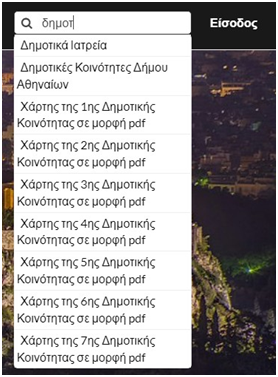
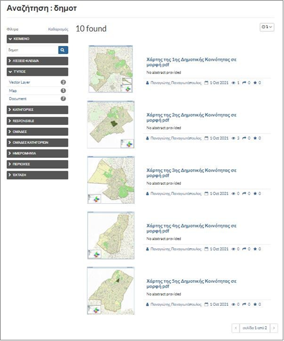

.. _keywordsearch:

=========================
Αναζήτηση με Λέξη-Κλειδί
=========================

Ο χρήστης μπορεί να αναζητήσει στοιχεία, πληκτρολογώντας την αντίστοιχη λέξη-κλειδί στο πεδίο «Αναζήτηση», που βρίσκεται στην αρχική σελίδα, επάνω δεξιά.

Καθώς πληκτρολογείται η λέξη, εμφανίζονται σε λίστα όλες οι πιθανές επιλογές. Για παράδειγμα, πληκτρολογώντας
«δημοτ», εμφανίζονται τα στοιχεία των Δημοτικών Ιατρείων και Δημοτικών Κοινοτήτων, καθώς και οι χάρτες για τις επτά Δημοτικές Κοινότητες του Δήμου Αθηναίων.

Η πληκτρολόγηση λέξης-κλειδί μπορεί να γίνει και στο πεδίο «Αναζήτηση», στο κέντρο της σελίδας.

Σε αυτή την περίπτωση εισάγεται η λέξη-κλειδί ή τμήμα αυτής και πατώντας «Enter», εμφανίζονται όλα τα στοιχεία που την περιλαμβάνουν.

.. figure:: img/Image4.png
        :width: 50%

Για παράδειγμα, πληκτρολογώντας «δημοτ» και πατώντας «Enter», εμφανίζονται δέκα στοιχεία σχετικά με την αναζήτηση που έγινε (Εικόνα 5). Η εξερεύνησή τους μπορεί να γίνει σύμφωνα με όσα έχουν περιγραφεί στα προηγούμενα.

